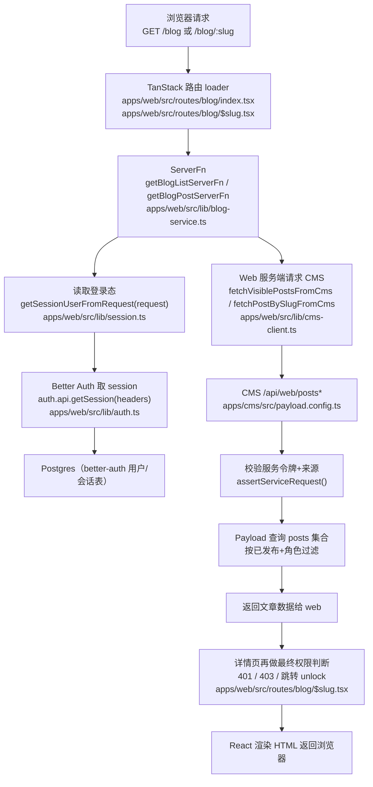
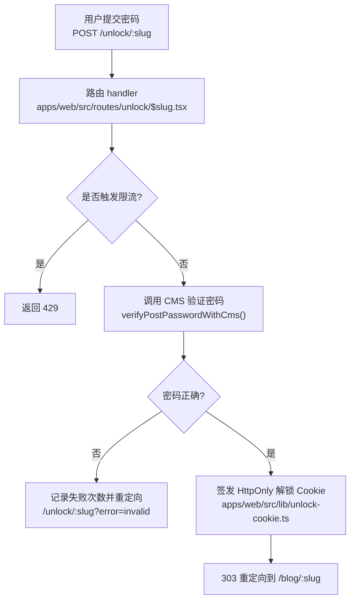

# 页面访问调用链路（小白版）

本文描述「用户打开博客页面」时，代码会经过哪些文件与函数。

## 1) 读文章页/列表页：`GET /blog`、`GET /blog/:slug`

## 2) 密码文章解锁：`POST /unlock/:slug`

## 3) 关键代码定位

- 登录态入口：`apps/web/src/lib/session.ts`
- 页面服务端聚合：`apps/web/src/lib/blog-service.ts`
- 详情页权限裁决：`apps/web/src/routes/blog/$slug.tsx`
- 解锁流程：`apps/web/src/routes/unlock/$slug.tsx`
- CMS 服务端接口：`apps/cms/src/payload.config.ts`
