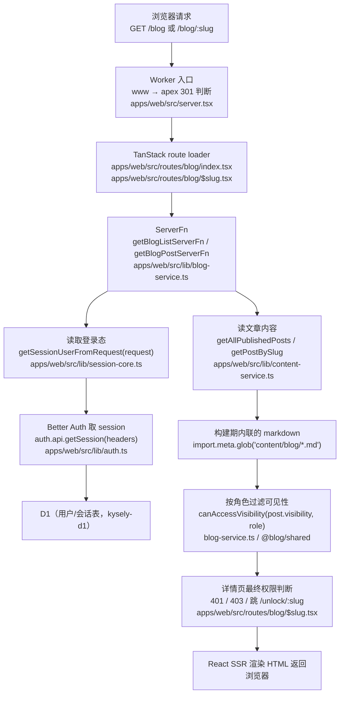
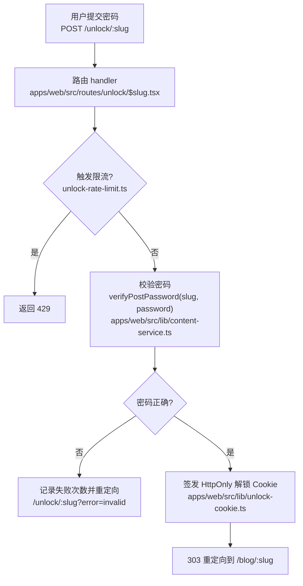

# 页面访问调用链路（小白版）

本文描述「用户打开博客页面」时，代码会经过哪些文件与函数。当前架构下**没有
CMS / Payload / Postgres**：文章内容是构建期内联的 git markdown，登录态来自 D1。

## 1) 读文章页/列表页：`GET /blog`、`GET /blog/:slug`

```mermaid
flowchart TD
  A["浏览器请求<br/>GET /blog 或 /blog/:slug"] --> W["Worker 入口<br/>www → apex 301 判断<br/>apps/web/src/server.tsx"]
  W --> B["TanStack route loader<br/>apps/web/src/routes/blog/index.tsx<br/>apps/web/src/routes/blog/$slug.tsx"]
  B --> C["ServerFn<br/>getBlogListServerFn / getBlogPostServerFn<br/>apps/web/src/lib/blog-service.ts"]
  C --> D["读取登录态<br/>getSessionUserFromRequest(request)<br/>apps/web/src/lib/session-core.ts"]
  D --> E["Better Auth 取 session<br/>auth.api.getSession(headers)<br/>apps/web/src/lib/auth.ts"]
  E --> F["D1（用户/会话表，kysely-d1）"]
  C --> G["读文章内容<br/>getAllPublishedPosts / getPostBySlug<br/>apps/web/src/lib/content-service.ts"]
  G --> H["构建期内联的 markdown<br/>import.meta.glob('content/blog/*.md')"]
  H --> I["按角色过滤可见性<br/>canAccessVisibility(post.visibility, role)<br/>blog-service.ts / @blog/shared"]
  I --> J["详情页最终权限判断<br/>401 / 403 / 跳 /unlock/:slug<br/>apps/web/src/routes/blog/$slug.tsx"]
  J --> K["React SSR 渲染 HTML 返回浏览器"]
```

## 2) 密码文章解锁：`POST /unlock/:slug`

```mermaid
flowchart TD
  A["用户提交密码<br/>POST /unlock/:slug"] --> B["路由 handler<br/>apps/web/src/routes/unlock/$slug.tsx"]
  B --> C{"触发限流?<br/>unlock-rate-limit.ts"}
  C -- "是" --> D["返回 429"]
  C -- "否" --> E["校验密码<br/>verifyPostPassword(slug, password)<br/>apps/web/src/lib/content-service.ts"]
  E --> F{"密码正确?"}
  F -- "否" --> G["记录失败次数并重定向<br/>/unlock/:slug?error=invalid"]
  F -- "是" --> H["签发 HttpOnly 解锁 Cookie<br/>apps/web/src/lib/unlock-cookie.ts"]
  H --> I["303 重定向到 /blog/:slug"]
```

密码来自文章 frontmatter（构建期内联），不在请求期查任何外部服务。

## 3) 关键代码定位

- Worker 入口（www → apex 301）：`apps/web/src/server.tsx`
- 登录态入口：`apps/web/src/lib/session-core.ts`
- 页面服务端聚合：`apps/web/src/lib/blog-service.ts`
- 文章内容（markdown 读取 + 密码校验）：`apps/web/src/lib/content-service.ts`
- 认证（Better Auth on D1）：`apps/web/src/lib/auth.ts`
- 详情页权限裁决：`apps/web/src/routes/blog/$slug.tsx`
- 解锁流程：`apps/web/src/routes/unlock/$slug.tsx` + `unlock-cookie.ts` / `unlock-rate-limit.ts`
